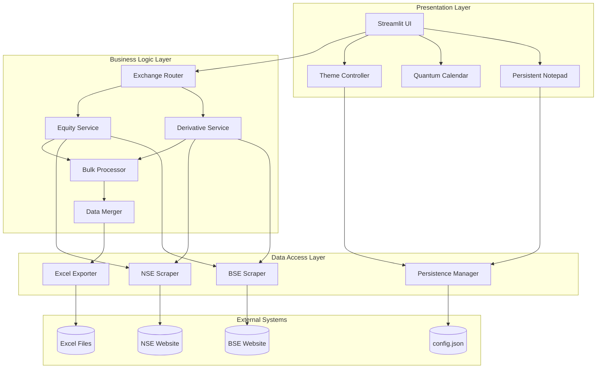

# Design Document

## Overview

The Quantum Market Suite is a Streamlit-based financial dashboard that provides dual-exchange (NSE/BSE) market data analysis capabilities. The system architecture follows a modular design with clear separation between UI components, data fetching services, persistence layer, and export functionality. The application uses a glassmorphism design language with theme switching support and persists user data through JSON file storage.

## Architecture



## Components and Interfaces

### 1. Exchange Router

**Purpose:** Routes data requests to the appropriate exchange scraper based on user selection.

```python
class ExchangeRouter:
    def __init__(self, exchange: str):
        """Initialize with 'NSE' or 'BSE'"""
        pass
    
    def get_equity_data(self, symbol: str, start_date: date, end_date: date) -> pd.DataFrame:
        """Fetch equity OHLC data from selected exchange"""
        pass
    
    def get_derivative_data(self, symbol: str, expiry: date, strike: float, option_type: str) -> pd.DataFrame:
        """Fetch derivative data from selected exchange"""
        pass
    
    def get_available_expiries(self, symbol: str) -> List[date]:
        """Get available expiry dates for a symbol"""
        pass
```

### 2. Equity Service

**Purpose:** Handles equity OHLC and volume data retrieval with progress tracking.

```python
class EquityService:
    def fetch_historical_data(
        self, 
        symbol: str, 
        start_date: date, 
        end_date: date,
        progress_callback: Callable[[float], None]
    ) -> EquityData:
        """Fetch historical OHLC + Volume data with progress updates"""
        pass
    
    def validate_date_range(self, start_date: date, end_date: date) -> ValidationResult:
        """Validate the date range is valid for trading data"""
        pass
```

### 3. Derivative Service

**Purpose:** Handles Options/Futures data retrieval including Open Interest.

```python
class DerivativeService:
    def fetch_options_chain(
        self,
        symbol: str,
        expiry: date,
        progress_callback: Callable[[float], None]
    ) -> DerivativeData:
        """Fetch complete options chain for an expiry"""
        pass
    
    def fetch_futures_data(
        self,
        symbol: str,
        expiry: date
    ) -> FuturesData:
        """Fetch futures contract data"""
        pass
    
    def get_call_put_split(self, options_data: DerivativeData) -> Tuple[pd.DataFrame, pd.DataFrame]:
        """Split options data into Call and Put DataFrames"""
        pass
```

### 4. Bulk Processor

**Purpose:** Orchestrates multi-stock data fetching with sequential processing.

```python
class BulkProcessor:
    def process_stocks(
        self,
        symbols: List[str],
        params: FetchParams,
        progress_callback: Callable[[str, float], None]
    ) -> BulkResult:
        """Process multiple stocks sequentially with progress tracking"""
        pass
    
    def get_processing_summary(self, result: BulkResult) -> ProcessingSummary:
        """Generate summary of successful/failed retrievals"""
        pass
```

### 5. Persistence Manager

**Purpose:** Handles all JSON-based storage operations for user data.

```python
class PersistenceManager:
    CONFIG_PATH = "config.json"
    
    def load_config(self) -> Config:
        """Load configuration from JSON file"""
        pass
    
    def save_config(self, config: Config) -> None:
        """Save configuration to JSON file"""
        pass
    
    def update_notepad(self, content: str) -> None:
        """Update notepad content with debouncing"""
        pass
    
    def add_search_history(self, entry: SearchHistoryEntry) -> None:
        """Add entry to search history, maintaining max 10 entries"""
        pass
    
    def set_theme(self, theme: str) -> None:
        """Save theme preference ('light' or 'dark')"""
        pass
```

### 6. Theme Controller

**Purpose:** Manages theme switching and CSS injection for glassmorphism effects.

```python
class ThemeController:
    def apply_theme(self, theme: str) -> None:
        """Apply light or dark theme CSS"""
        pass
    
    def get_glassmorphism_css(self, theme: str) -> str:
        """Generate glassmorphism CSS for the specified theme"""
        pass
    
    def toggle_theme(self) -> str:
        """Toggle between light and dark, return new theme"""
        pass
```

### 7. Excel Exporter

**Purpose:** Generates professionally formatted Excel files with merged data.

```python
class ExcelExporter:
    def export_to_excel(
        self,
        data: Dict[str, MergedStockData],
        filename: str
    ) -> bytes:
        """Generate Excel file with company tabs and side-by-side data"""
        pass
    
    def format_worksheet(self, ws: Worksheet, data: MergedStockData) -> None:
        """Apply professional formatting to worksheet"""
        pass
    
    def merge_equity_derivative(
        self,
        equity: pd.DataFrame,
        calls: pd.DataFrame,
        puts: pd.DataFrame
    ) -> pd.DataFrame:
        """Merge equity and derivative data side-by-side"""
        pass
```

### 8. Scraper Base (Anti-Detection)

**Purpose:** Base scraper with anti-detection measures.

```python
class ScraperBase:
    USER_AGENTS = [...]  # List of user agents to rotate
    
    def __init__(self):
        """Initialize undetected-chromedriver in headless mode"""
        pass
    
    def random_delay(self, min_sec: float = 1.0, max_sec: float = 3.0) -> None:
        """Implement human-like random delay"""
        pass
    
    def handle_rate_limit(self) -> None:
        """Wait 30 seconds on rate limit detection"""
        pass
    
    def rotate_user_agent(self) -> None:
        """Switch to a different user agent"""
        pass
```

## Data Models

### Config Model
```python
@dataclass
class Config:
    notepad_content: str = ""
    search_history: List[SearchHistoryEntry] = field(default_factory=list)
    theme: str = "dark"
    last_exchange: str = "NSE"
```

### Search History Entry
```python
@dataclass
class SearchHistoryEntry:
    symbol: str
    exchange: str
    start_date: str  # ISO format
    end_date: str    # ISO format
    timestamp: str   # ISO format
    data_type: str   # 'equity', 'derivative', or 'both'
```

### Equity Data
```python
@dataclass
class EquityData:
    symbol: str
    exchange: str
    data: pd.DataFrame  # Columns: Date, Open, High, Low, Close, Volume
    fetch_timestamp: datetime
```

### Derivative Data
```python
@dataclass
class DerivativeData:
    symbol: str
    exchange: str
    expiry: date
    calls: pd.DataFrame   # Columns: Strike, Open, High, Low, Close, OI, Volume
    puts: pd.DataFrame    # Columns: Strike, Open, High, Low, Close, OI, Volume
    futures: pd.DataFrame # Columns: Expiry, Open, High, Low, Close, OI, Volume
    fetch_timestamp: datetime
```

### Merged Stock Data
```python
@dataclass
class MergedStockData:
    symbol: str
    equity_data: pd.DataFrame
    call_data: pd.DataFrame
    put_data: pd.DataFrame
    merged_view: pd.DataFrame  # Side-by-side merged data
```

### Bulk Result
```python
@dataclass
class BulkResult:
    successful: Dict[str, MergedStockData]
    failed: Dict[str, str]  # symbol -> error message
    total_time: float
```

### Validation Result
```python
@dataclass
class ValidationResult:
    is_valid: bool
    error_message: Optional[str] = None
```


## Correctness Properties

*A property is a characteristic or behavior that should hold true across all valid executions of a system-essentially, a formal statement about what the system should do. Properties serve as the bridge between human-readable specifications and machine-verifiable correctness guarantees.*

### Property 1: Exchange Routing Consistency
*For any* exchange selection (NSE or BSE), all subsequent data fetching operations SHALL use scrapers corresponding to that exchange, and the returned data SHALL include the correct exchange identifier.
**Validates: Requirements 1.2**

### Property 2: Exchange Switch State Reset
*For any* exchange change event, the application state SHALL clear all previously loaded equity and derivative data, resulting in empty data containers.
**Validates: Requirements 1.3**

### Property 3: Equity Data Completeness
*For any* valid stock symbol and date range, the returned equity DataFrame SHALL contain columns for Date, Open, High, Low, Close, and Volume, with all numeric columns containing valid numerical values.
**Validates: Requirements 2.1, 2.2**

### Property 4: Derivative Data Structure
*For any* valid derivative data request, the returned data SHALL contain separate Call and Put DataFrames, each with columns for Strike, Open, High, Low, Close, Open Interest, and Volume, plus expiry date and contract type metadata.
**Validates: Requirements 3.1, 3.2, 3.3**

### Property 5: Anti-Detection Delay Bounds
*For any* sequence of scraping requests, the delay between consecutive requests SHALL be between 1.0 and 3.0 seconds (inclusive), and user-agent strings SHALL vary across requests.
**Validates: Requirements 3.5, 10.2, 10.4**

### Property 6: Bulk Processing Completeness
*For any* list of N stocks submitted for bulk processing, the result SHALL contain exactly N entries split between successful and failed categories, with no stock missing or duplicated.
**Validates: Requirements 4.1, 4.3**

### Property 7: Bulk Processing Fault Tolerance
*For any* bulk processing operation where one stock fails, the remaining stocks SHALL still be processed, and the final result SHALL contain data for all successfully processed stocks.
**Validates: Requirements 4.4**

### Property 8: Config Persistence Round-Trip
*For any* Config object containing notepad content, search history, and theme preference, serializing to JSON and deserializing back SHALL produce an equivalent Config object with all text formatting preserved.
**Validates: Requirements 5.2, 5.3, 7.3**

### Property 9: Search History Size Invariant
*For any* sequence of search history additions, the stored history list SHALL never exceed 10 entries, with the most recent entries preserved and oldest entries removed.
**Validates: Requirements 6.2**

### Property 10: Search History Entry Completeness
*For any* completed data fetch operation, the recorded search history entry SHALL contain the symbol, exchange, start date, end date, timestamp, and data type fields.
**Validates: Requirements 6.1**

### Property 11: Theme Persistence
*For any* theme change operation, the config.json file SHALL immediately reflect the new theme value, and subsequent application loads SHALL restore that theme.
**Validates: Requirements 7.2, 7.3**

### Property 12: Date Range Validation
*For any* date range where end_date is before start_date, the validation function SHALL return an invalid result with an appropriate error message.
**Validates: Requirements 9.4**

### Property 13: Rate Limit Retry Timing
*For any* rate-limited request, the system SHALL wait exactly 30 seconds (±1 second tolerance) before retrying the request.
**Validates: Requirements 10.3**

### Property 14: Excel Export Structure
*For any* export request with N companies, the generated Excel file SHALL contain exactly N worksheets, each named after the company symbol, with equity data and derivative data placed side-by-side with professional formatting (headers, borders, appropriate column widths).
**Validates: Requirements 11.1, 11.2, 11.3**

### Property 15: Export History Recording
*For any* successful Excel export, the download history SHALL be updated with the export timestamp and filename.
**Validates: Requirements 11.4**

## Error Handling

### Scraping Errors
| Error Type | Detection | Response |
|------------|-----------|----------|
| Network Timeout | Request exceeds 30s | Retry up to 3 times with exponential backoff |
| Rate Limiting | HTTP 429 or block page | Wait 30 seconds, rotate user-agent, retry |
| Invalid Symbol | Empty response or 404 | Return error with symbol name, continue bulk processing |
| Page Structure Change | Missing expected elements | Log error, notify user, skip symbol |

### Data Validation Errors
| Error Type | Detection | Response |
|------------|-----------|----------|
| Invalid Date Range | end_date < start_date | Display validation error, prevent submission |
| Missing Required Fields | Null/empty in required columns | Filter out invalid rows, warn user |
| Data Type Mismatch | Non-numeric in numeric columns | Attempt conversion, mark as invalid if fails |

### Persistence Errors
| Error Type | Detection | Response |
|------------|-----------|----------|
| Config File Missing | FileNotFoundError | Create new config with defaults |
| Config File Corrupt | JSONDecodeError | Backup corrupt file, create new config |
| Write Permission Denied | PermissionError | Use session state as fallback, warn user |

### Export Errors
| Error Type | Detection | Response |
|------------|-----------|----------|
| No Data to Export | Empty data containers | Disable export button, show message |
| Excel Generation Failure | OpenPyXL exception | Display error, offer retry |
| File Size Exceeded | Output > 50MB | Split into multiple files |

## Testing Strategy

### Property-Based Testing Framework
The project will use **Hypothesis** for Python property-based testing. Each correctness property will be implemented as a Hypothesis test with a minimum of 100 iterations.

### Unit Tests
Unit tests will cover:
- Individual scraper methods with mocked responses
- Data transformation functions
- Config serialization/deserialization
- Date validation logic
- Excel formatting functions

### Property-Based Tests
Each correctness property from the design will have a corresponding property-based test:

1. **Property 1 Test**: Generate random exchange selections, verify routing
2. **Property 2 Test**: Generate state with data, trigger exchange switch, verify cleared
3. **Property 3 Test**: Generate valid symbols/dates, verify DataFrame structure
4. **Property 4 Test**: Generate derivative requests, verify Call/Put separation
5. **Property 5 Test**: Generate request sequences, measure delays
6. **Property 6 Test**: Generate stock lists, verify result completeness
7. **Property 7 Test**: Generate lists with failing stocks, verify continuation
8. **Property 8 Test**: Generate Config objects, verify round-trip equality
9. **Property 9 Test**: Generate history addition sequences, verify max size
10. **Property 10 Test**: Generate fetch operations, verify entry fields
11. **Property 11 Test**: Generate theme changes, verify persistence
12. **Property 12 Test**: Generate date pairs, verify validation
13. **Property 13 Test**: Simulate rate limits, measure retry timing
14. **Property 14 Test**: Generate multi-company data, verify Excel structure
15. **Property 15 Test**: Generate exports, verify history update

### Test Annotations
All property-based tests will be annotated with:
```python
# **Feature: quantum-market-suite, Property {number}: {property_text}**
# **Validates: Requirements X.Y**
```

### Integration Tests
- End-to-end flow: Select exchange → Select stocks → Fetch data → Export Excel
- Persistence flow: Change settings → Reload app → Verify restoration
- Bulk processing flow: Select multiple stocks → Process → Verify all results

### Test Data Generators
Custom Hypothesis strategies for:
- Valid stock symbols (from predefined list)
- Valid date ranges (trading days only)
- Config objects with various content
- Search history entries
- Derivative parameters (strike, expiry, type)
